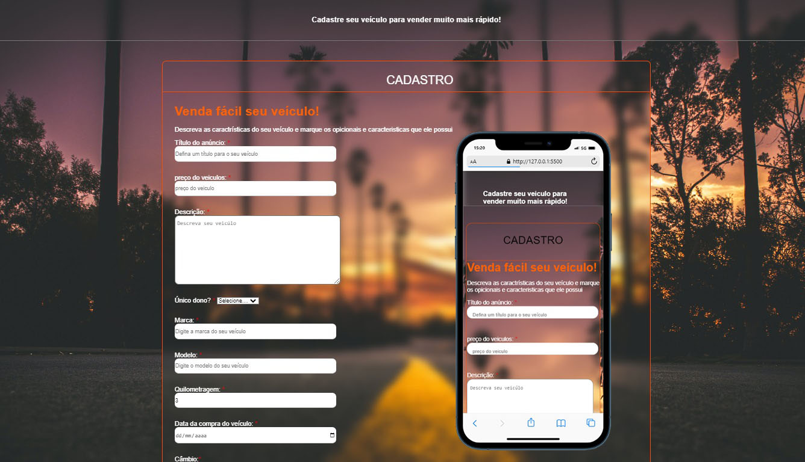

<h1 align="center"> Projeto cadastro de veículos </h1>

  

 

## 🚀 Tecnologias

Esse projeto foi desenvolvido com as seguintes tecnologias:

## 💻 Projeto

O projeto consiste em um formulário de cadastro simples e intuitivo, onde os usuários. Para tornar o processo ainda mais fácil, o formulário é responsivo e pode ser facilmente acessado em diferentes dispositivos, desde celulares até computadores.

- [Acesse o projeto finalizado, online](https://lnkd.in/d3weNXDB)

